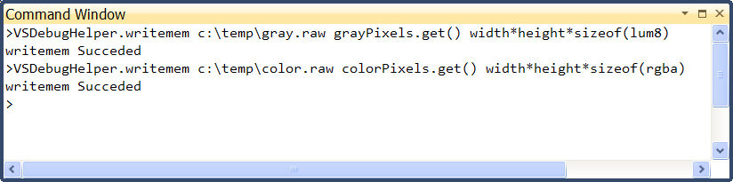
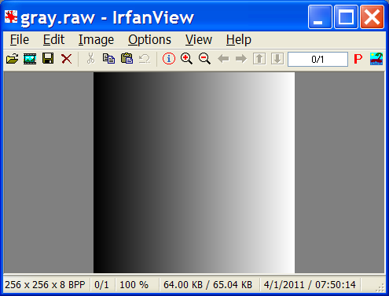
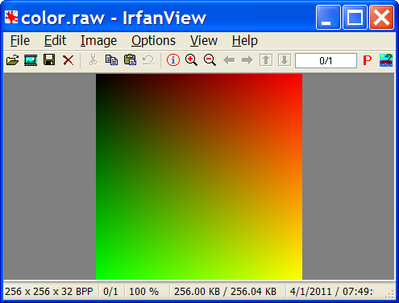
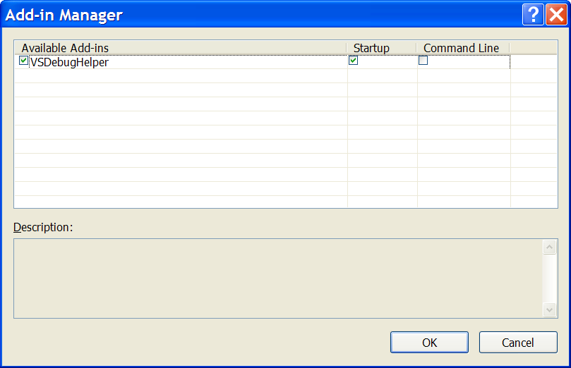
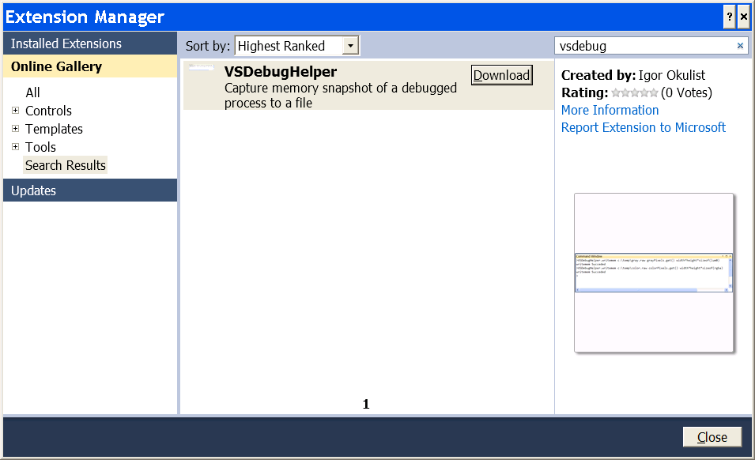
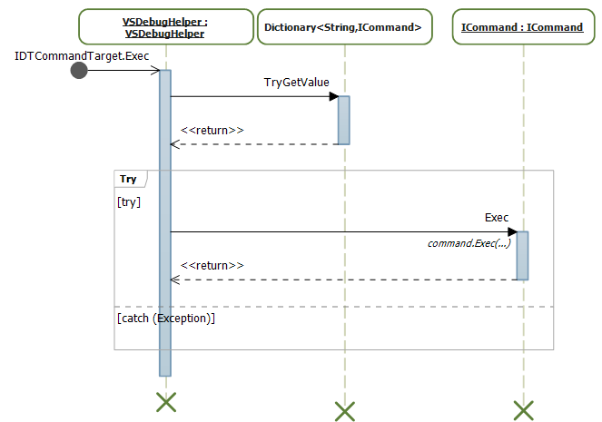

## Download
[Download VSDebugHelper.vsi](VSDebugHelper.vsi "VSDebugHelper.vsi")

## Introduction
At times I need to look into a processing step of a pipeline, either to
identify a performance improvement or as part of impact analysis. If 
the step is covered by a unit test then it is a bit easier to analyze, 
but alas this is not always the case.

In such instance, a general approach is to isolate a buffer of data
being processed and extract it to a data file. Then the data can be
analyzed separately or the data can be used to create a unit test. In 
the later case the unit test can be used to test the performance 
improvement.

There are generally two ways of capturing the buffer: either to modify
the source code to add the data dump procedure (ex. fopen/fwrite/fclose)
or restarting the debug session with WinDBG and using writemem extension.

Both of the above methods are robust but inefficient as both require restarting
of the debug session and one of them requires recompilation of the
sources, which may be time consuming. 

Hence the VsDebugHelper addin was born. VsDebugHelper addin allows to
capture a buffer from the program being debugged into a data file and back.

## Using VsDebugHelper Add-in
The steps to use the add-in are rather simple:

+ Make sure VsDebugHelper is loaded by checking Tools\Addin manager...
+ Start debugging application and `break` on the desired location
+ Use one or more of the commands from VsDebugHelper

Once loaded the plugin adds two commands to Visual Studio environment, 
which can be executed from Visual Studio Command Window.

### VsDebugHelper Commands
Following commands are inspired WinDBG extension and provide following 
functionality:

+ writemem - Write memory to file
  
  Usage: `writemem <filename> <address> <length>`
    
  + filename - destination file name.
  + address - starting address of the buffer. 
  + length - length of the data to be copied. 
  
+ readmem - Read memory from File

  Usage: `readmem <filename> <address> <length>`

  + Attention: To see the effect of readmem in Visual Studio you need
'step' after readmem was called.
  + filename - source file name.
  + address - starting address of the buffer. 
  + length - length of the data to be copied.
  
Both `address` and `length` arguments can be variable names or an expression.

### VsDebugHelper example usage
Here is an example how VsDebugHelper can capture a buffer of pixels:

    std::auto_ptr<lum8> grayPixels(new lum8[width*height]);
    ...
    std::auto_ptr<rgba> colorPixels(new rgba[width*height]);
    ...
    

Note that arguments are variables and expressions of expressions, which are
evaluated by the debugger. If you run into any issue, first double check that
all expressions can be resolved in the watch window.

And here how the raw data displayed by an external viewer (IrfranView): 

## Installation
### Installation by direct download
Proceed with download and install at the top of the article. After the installation
confirm addin is installed and set to be loaded at startup as shown below:

### Installation through Extension Manager
Alternatevly, the addin can be installed from within Visual Studio though
the use of Extension Manager as shown below:

## Addin internals
Visual Studio has a number of extensibility technologies, but useful
documentation is very difficult to find. Additionally, there significant
disconnect as what is available to managed extension vs unmanaged
extensions. It is rather clear that Visual Studio is an unmanaged
application, yet there is no information how to interact from an unmanaged 
addin. And interestingly enough, extensibility functionality for 'Visualizer' 
has been is clearly cut off.

Besides being a nuisance the above boils down to on issue that there is no way to
work through Visual Studio to modify a region of memory. Hence when readmem command
is used (to load a buffer from file) the Watch and Memory Window display will be 
out of sync with actual memory contents. 

Overall sequence of execution is pretty simple. Visual studio calls CommandTarget 
interface and its implementation will dispatch the call ICommand implementation based 
on the command string. ICommand implementation is responsible for parsing command 
parameters and etc. Simplified diagram is shown below:

